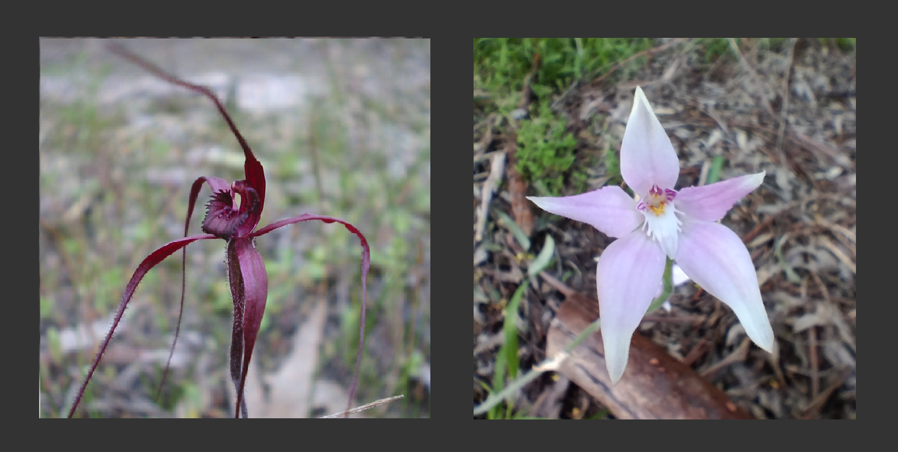
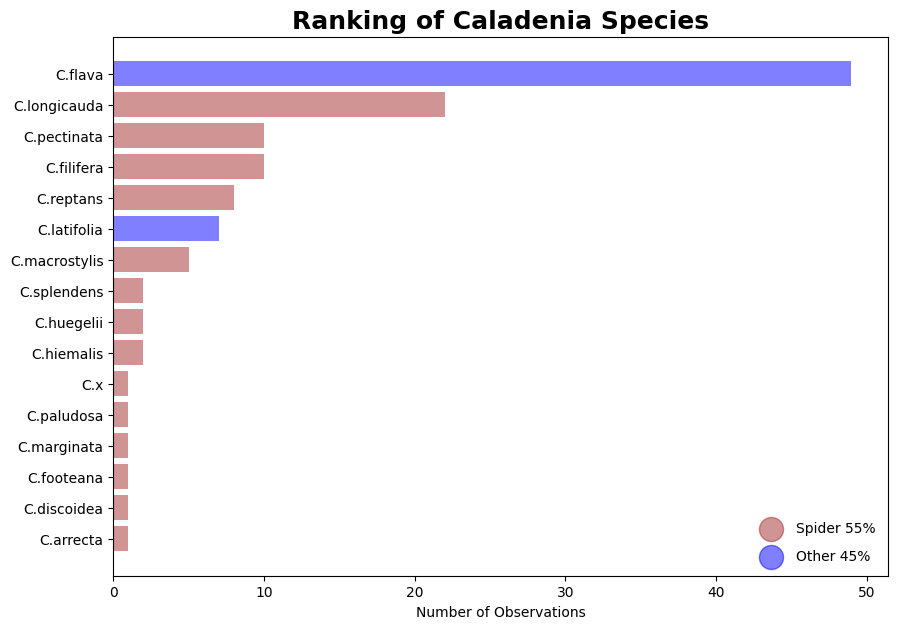
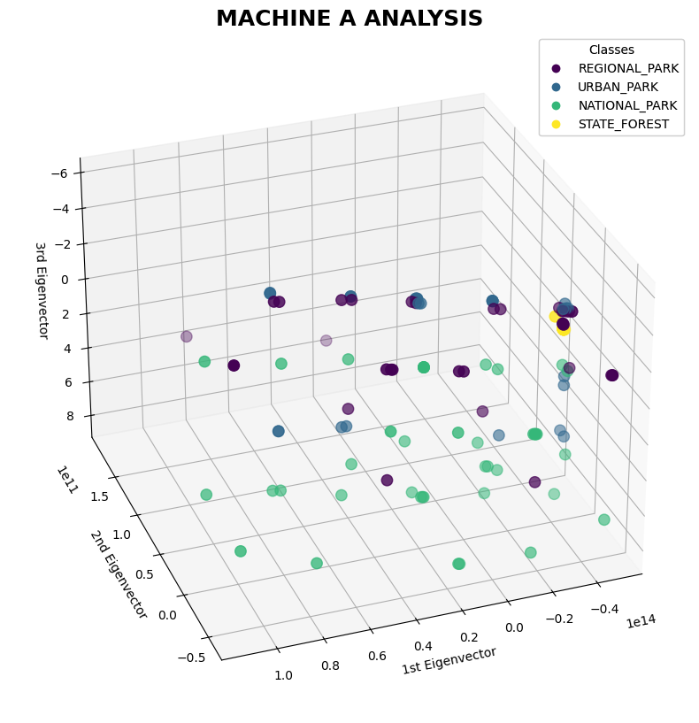
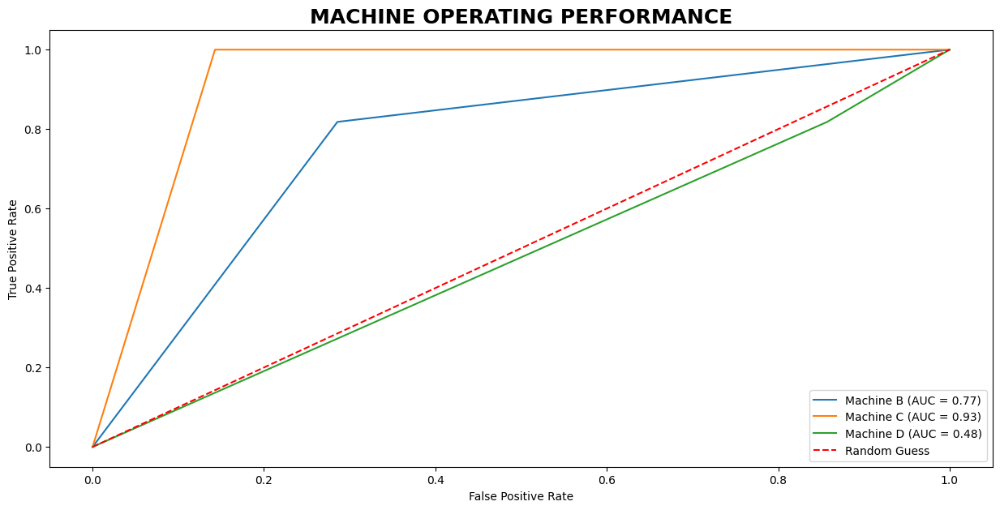
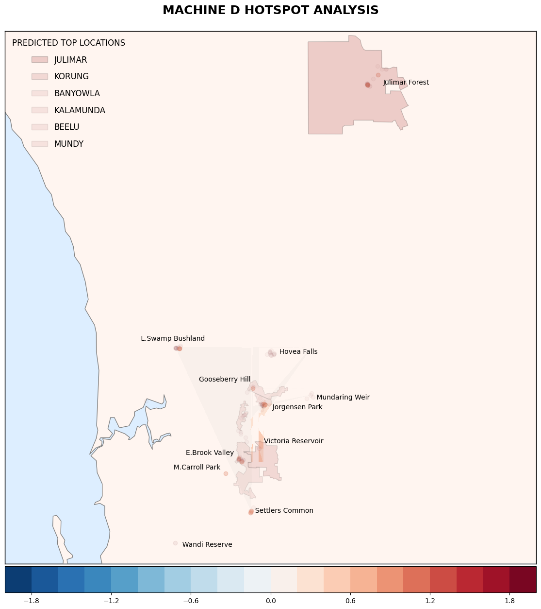

# CALADENIA: Insights into Spider Orchids with supervised learning.

<figure>
    

    
    

    Spiders (C.filifera) and Broad-Sepal (C.latifolia)
</figure>

## The BioBlitz weekend at Julimar Forest was a great experience, bringing together a vibrant community of specialists and enthusiasts who shared expert insights. I was particularly fascinated to see so many Blood Spider Orchids—a species I’ve never encountered on my walks closer to home.

Belonging to the genus _Caladenia_, the blood spider orchids often burst into flower in areas with seasonal fires—perhaps a rare silver lining in Julimar's recovery after prescribed burns. Like all orchids, they are interesting in that they rely on intricate ecological relationships to survive, perhaps making them excellent indicators of a healthy ecosystem. In this exercise, observational details of _Caladenia_ are combined with machine-learning algorithms to explore where Spider Orchids might thrive in areas around Perth.

### Content
<ol>
  <li><a href="#features">Features</a></li>
  <li><a href="#machine-learning">Machine Learning</a></li>
  <li><a href="#machine-performance">Machine Performance</a></li>
  <li><a href="#machine-induction">Machine Induction</a></li>
  <li><a href="#references">References</a></li>
</ol>

<!-- ABOUT THE PROJECT -->
### Features

_Caladenia_ orchids are commonly known as spider orchids which consist of 136 species in Western Australia. The dataset used for this exercise contains 16 species, with cowslip orchids (C. flava) being the most commonly observed in the region. For this analysis, the recorded species have been informally grouped into a binary classification: those with long, narrow sepals and petals (“spiders”) and those with broader ones (“broad-sepals”).

<figure>
    

    
    
 
</figure>

Orchids in general lacks chlorophyll during germination and depend on a type of basidios jelly fungus, which comes packaged in the seed to provide nutrition until the plant can begin photosynthesis. The distribution and diversity of these species are therefore strongly dependent on the availability of their fungal symbionts.

During periods of dormancy, nutrients are stored in the tubers, allowing the plants to survive extreme conditions beneath the soil surface until conditions improve. In the Perth region, the flowering season runs from July to November, with some species blooming only briefly. These orchids grow on the ground in open areas across a variety of vegetation types and habitats.

(<a href="#readme-top">back to top</a>)

### Machine Learning

Is an area of technology having roots in Artificial Intelligence and Statistics with techniques for identifying patterns and relationships within datasets. In this exercise key ecological features have been extracted to enable predictive modelling of spider orchid occurrences. Four machines have been built with distinctive supervised learning techniques from the scikit-learn library and trained on presence-only data to estimate potential species likelihood and distribution.

**Machine A**

Aims to identify patterns in the data and represent them in a way that highlights similarities and differences. It employs a technique that isolates and extrapolates additional information by compressing and reducing the dimensionality of the feature set with minimal information loss.

<figure>
    

    
    

</figure>

The figure shows the machine's output with the transformed data decomposed into three components (eigenvectors) which illustrates the relationships among different park habitats. The third component exhibits the least variance, indicating a notable common feature between the state forest, regional, and urban parks that distinguishes them from national parks. This distinction would mainly reflect differences in human influence.

National parks in the Perth region are primarily established to conserve native flora and fauna, with strict regulations in place. In contrast, state forests, urban parks, and regional parks accommodate a range of recreational activities and use. For example, Julimar State Forest allows potential resource use (e.g., mining) and follows a different fire management regime compared to the other park types.

**Machine B**

Using the principal components derived from Machine A, training data are then transformed and processed by Machine B to optimise habitat-related relationships. Machine B applies a logistic transformation to reduce overfitting and underfitting in the species distribution modeling. Preprocessing with Machine A output is done because of the complex ecology of orchids that makes them highly sensitive to habitat destruction, fragmentation, land use, and unsustainable biodiversity exploitation. The model computes a probability density representing the relative likelihood of species presence based on available features compared to background points.

**Machine C**

This machine employs an analysis technique on the training dataset that uses multiple decision trees. It prunes and selects from different random subsets, calculates individual results, and then merges them to produce a single outcome. This approach provides strong performance, mitigates overfitting, and can handle both continuous and categorical variables efficiently due to its randomised design. Each individual tree generates a likelihood estimate of spider orchid presence, and the final prediction is typically the average of all tree estimations.

**Machine D**

Performs an analysis of the training data to identify the optimal boundary separating spider orchids from broad-sepal orchids. By evaluating the distance between points of the two classes and the clarity of their separation, it estimates the likelihood of the predominant _Caladenia_ type at a given location. This method is particularly effective at identifying spider orchids in areas with non-typical features (outliers). Consequently, it will be used to model the potential distribution even though its accuracy may be lower in regions dominated by the majority class.

(<a href="#readme-top">back to top</a>)

### Machine Performance

The figure illustrates the performance of each classifier across all possible thresholds. It compares the true-positive rate against the false-positive rate, highlighting the trade-offs between sensitivity and specificity at different threshold settings. Overall performance is summarised by the Area Under the Curve (AUC), with higher values indicating better predictive ability. Machine C achieves the highest performance in estimating the likelihood of spider orchid presence.

<figure>
    

    
    

</figure>

(<a href="#readme-top">back to top</a>)

### Machine Induction

For this exercise, the machines were set to predict spider orchids in commonly visited localities around Perth for 2025. From personal observations, spider orchids have only been recorded at Julimar Forest and Banyowla Regional Park, specifically near Ellis Brook Valley. In the graph, although both localities are represented with likelihood estimates, Julimar shows relatively low predicted values, despite observational records indicating an abundance of spider orchids there. This discrepancy may reflect the complex ecological factors influencing orchid growth, suggesting that Julimar may be particularly sensitive to environmental changes such as land use or coverage.

<figure>
    

    
    

</figure>

Machine C provided the most accurate predictions, indicating a 95% probability of spotting a spider orchid at Lightning Swamp Bushland. Machine B performed less accurately but leveraged underlying habitat relationships derived from Machine A, highlighting Julimar Forest, Mary Carroll Park, and Kalamunda National Park as areas potentially more vulnerable to environmental changes affecting spider orchid growth. For example, pink fairy orchids (_C. latifolia_) were observed at Mary Carroll Park for the first time in 2023, absent the following year after a new playground was developed, and reappeared in 2025 at a nearby undisturbed area.

<figure>
    

    
    

</figure>

Machine D predicted spider orchid presence only at Julimar State Forest and Korung National Park. Due to its high false-positive rate, only these two localities were considered reliable for probability estimation. Julimar, having the largest cluster of presence-only data, was assigned a 58% probability. Machine D excels at identifying areas outside typical spider orchid habitats, which are mapped as “hotspots” in the above figure. Since the dataset classifies _Caladenia_ types in binary terms, these hotspots would correspond to areas where broad-sepal orchids occur, which are conditions suitable for spider orchids. The species spread was estimated by scoring each hotspot and generating contour regions based on these values. The coloured area near Victoria Reservoir, where the contours overlap, represents both distribution and magnitude. This figure also ranks the parks by their suitability for spider orchids, using density coloring-Julimar State Forest is estimated as the most suitable, whereas Mundy Regional Park is the least.

(<a href="#readme-top">back to top</a>)

### References
<ol>
  <li>Richards, S (2025). Julimar Forest BioBlitz Reveals Rich Biodiversity. https://julimarcafa.org.au/news/julimar-forest-bioblitz-reveals-rich-biodiversity/ Accessed 23 November 2025.</li>
  <li>Tsiftsis, S. Stipkova, Z. Rejmanek, M. Kindlmann, P (2024). Predictions of species distributions based only on models estimating future climate change are not reliable. https://www.nature.com/articles/s41598-024-76524-5 Accessed 20 October 2025</li>
  <li>Seifert, K. (2022). The hidden kingdom of fungi. Australia: University of Queensland Press.</li>
  <li>Mehra, S. (2020). Fungal Endophytes: Australian Terrestrial Orchids. https://www.intechopen.com/chapters/71812 Accessed 14 October 2025.</li>
</ol>

(<a href="#readme-top">back to top</a>)

